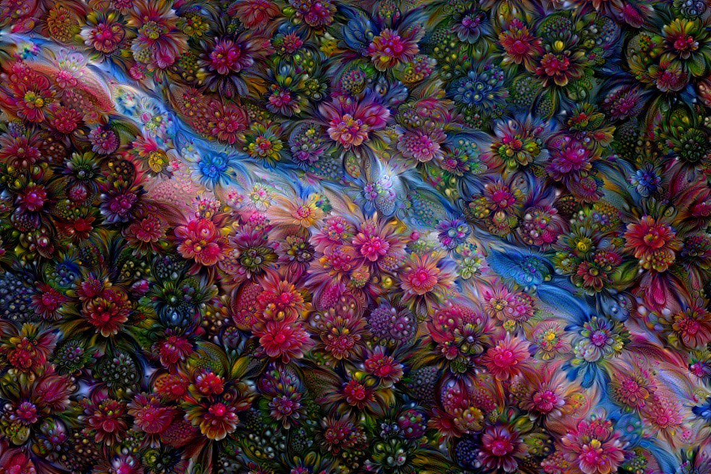
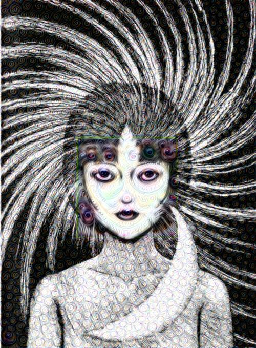
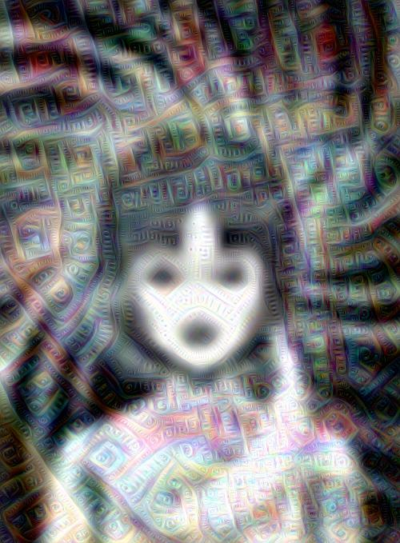

# bigSleeper
Deep Dreaming Experimenting in Python

In progress. Contains utilities in bin/deepDream.py. Testing-driven development being built using nose. Tensorflow and opencv as main libraries.

Basic Deep Dream image, from a space image

# Still Images

Current concept for this project is to particularly target faces in images, and to create horror images, and eventually short videos. The current flow is to preprocess images and isolate faces in images using a opencv Haar filter:

Then use that face image as the input for the deep dream algorithm to calculate the gradient of the image. After getting the optimized value based on the gradient and the layer tensor, apply the value to the original image. This will cause the algorithm to respond to values within the facial box, distorting facial features. Outside the facial boxes, the algorithm will be agnostic to features.

Playing with the options a bit can get more horrifying

# Video

Videos are made by processing each image independenently as a sequence.

Also generated is the window of the facial recognition, which has interesting results.

